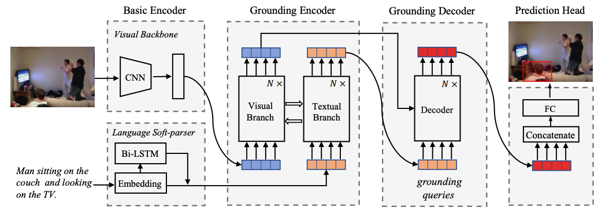
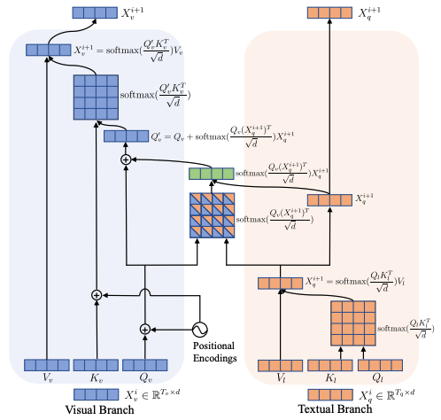

# VGTR Reproduction
A reproduction of Visual Grounding with Transformers

This repository contains the code for [**TransVG**](https://arxiv.org/abs/2104.08541) and a reproduction of [**Visual Grounding with Transformers**](https://arxiv.org/pdf/2105.04281.pdf).

For TransVG's official repo and instructions, please refer to [README_TransVG.md](./README_TransVG.md) or [official repository](https://github.com/djiajunustc/TransVG)

## Dataset Preparation

Please place the data (RefCOCO, RefCOCO+, RefCOCOg, ReferItGame) or the soft link of dataset folder under ./ln_data/. We follow dataset structure DMS. To accomplish this, the [download_data.sh](../ln_data/download_data.sh) bash script from DMS can be used.

```
cd ./ln_data
bash download_data.sh --path .
```

Please download data indices from [[Gdrive]](https://drive.google.com/file/d/1fVwdDvXNbH8uuq_pHD_o5HI7yqeuz0yS/view?usp=sharing) or [[One Drive]](https://uofr-my.sharepoint.com/:f:/g/personal/zyang39_ur_rochester_edu/???), and place them as the ./data folder.

```
rm -r ./data
tar -xvf data.tar
```

## VGTR
Here is the VGTR structure and the structure of its grounding transformer encoder. 
<p align="center">  </p>
<p align="center">  </p>

This reproduction is not yet successful. There are several ambiguous points needed to be addressed.
- How are the raw visual features transformed and reshaped into the visual tokens? In this reproduction, transformations are done with convolution operation. 
- What are the structure hyperparameters for the textual encoder? including BLSTM's hidden size, number of layers. Here is the BLSTM used in this reproduction. LSTM(256, 512, num_layers=4, batch_first=True, dropout=0.3, bidirectional=True)
- Does the grounding decoder use positional embedding for visual keys? In this reproduction, the result in outputs/VGTR2 doesn't use positional embedding in decoders and the result in outputs/VGTR3 uses. 
- What are the structure hyperparameters for the prediction head? including hidden sizes. In this reproduction, the prediction head's hidden layers are all 256.
- Does the model adopt any dropout layers at some points? 

running script
```
CUDA_VISIBLE_DEVICES=3 python train.py --model_enc_vis vgtr --lr_resnet 1e-4 --vgtr_visual_out_dim 256 --lr_bilstm 1e-4 --model_enc_lang vgtr --bilstm_hidden_dim 512 --embedding_dim 256 --bilstm_layers 4 --bilstm_out_dim 4 --bilstm_dropout 0.3 --hidden_dim 256 --enc_layers 2 --dec_layers 2 --pre_norm --model_name vgtr --optimizer adamw --lr_scheduler vgtr_decay --output_dir ./outputs/VGTR2 --dataset unc --dataset_fraction 0.25 2>&1 | tee outputs/VGTR2/training.log
```
The training log is stored at outputs/VGTR2/log.txt and outputs/VGTR3/log.txt. The training loss is decreasing and the validation accuracy fluctuates around 0.1 in VGTR2 and keeps decreasing in VGTR3.

If there is anyone interested in VGTR reproduction or having answers to the above problems, I'm more than happy to communicate. 


### Acknowledge
This codebase is partially based on [TransVG](https://github.com/djiajunustc/TransVG)
